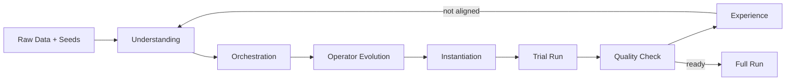

<div align="center">

# DataEvolver

**Automatic data preparation for LLMs via multi-level self-evolving pipelines**

Turn noisy raw data + a handful of seed examples into **training-ready, seed-aligned datasets** — with executable DAGs, trial feedback, and iterative refinement built in.

<br/>

[](https://www.python.org/)
[](https://fastapi.tiangolo.com/)
[](https://react.dev/)
[](assets/DataEvolver.pdf)
[](#-demo)

[Paper](assets/DataEvolver.pdf) · [Demo](#-demo) · [Quick Start](#-quick-start) · [Usage](#-usage) · [Results](#-results) · [Community](#-community)

<br/>


<br/>

<sub><b>Give us a ⭐ if DataEvolver helps your data prep workflow — it helps others discover the project.</b></sub>

</div>

---

## TL;DR

| You provide | DataEvolver does | You get |
|---|---|---|
| Raw data | Understands target profile from seeds | Structured understanding artifact |
| Seed examples | Orchestrates & validates operator DAGs | Executable pipeline plan |
| Optional task description | Instantiates, trials, judges, evolves | High-quality prepared data |

> **One sentence:** DataEvolver is a self-evolving data-prep system that jointly optimizes **executability** and **seed alignment**, not just one-shot pipeline synthesis.

---

## Table of Contents

- [Why DataEvolver](#-why-dataevolver)
- [Highlights](#-highlights)
- [How It Works](#-how-it-works)
- [Results](#-results)
- [Demo](#-demo)
- [Quick Start](#-quick-start)
- [Usage](#-usage)
- [Project Structure](#-project-structure)
- [Configuration](#-configuration)
- [FAQ](#-faq)
- [Community](#-community)
- [Citation](#-citation)

---

## 🔥 Why DataEvolver

Training data quality remains a bottleneck in LLM post-training. Raw corpora are often noisy, structurally inconsistent, or misaligned with the supervision style you actually want.

Most existing approaches fall into two camps:

| Approach | Strength | Limitation |
|---|---|---|
| **Predefined recipes** | Stable engineering | Hard to adapt to new tasks |
| **One-shot pipeline synthesis** | Flexible | Often fragile in execution & quality |

DataEvolver targets a harder, more practical question:

> **Can we automatically build a high-quality data preparation pipeline from raw data and only a small set of seed examples?**

That requires optimizing two goals at once:

- **Executability** — the pipeline must actually run end-to-end
- **Quality alignment** — outputs must match the profile implied by seeds

DataEvolver achieves this through **multi-level self-evolving**: operator-level DAG repair + pipeline-level experience feedback across rounds.

---

## ✨ Highlights

- **Seed-guided understanding** — infer schema, style, and quality constraints from seeds + sampled raw data
- **Operator-level self-evolving** — build, validate, and repair DAGs; synthesize operators when the registry is insufficient
- **Pipeline-level self-evolving** — trial runs, pilot judging, experience summarization, and next-round refinement
- **Three aligned interfaces** — Web UI, CLI, and HTTP API share the same workflow semantics
- **Observable by design** — stage artifacts, orchestration retries, token ledger, and round history are all inspectable
- **Open & extensible** — modular subsystems, editable operator registry, and scriptable automation

---

## 🧠 How It Works

<p align="center">
  
</p>



**Core workflow loop**

```text
understanding → orchestration → operator_evolution → instantiation → trial_run → quality_check → experience
```

When quality criteria are met, DataEvolver runs the refined pipeline on the full dataset.

### Three self-evolving layers

1. **Understanding** — learn the target data profile from seeds and raw samples  
2. **Operator evolution** — fix DAG structure, dependencies, and missing capabilities  
3. **Pipeline evolution** — convert trial-vs-seed gaps into reusable experience for the next round  

---

## 📊 Results

### Overall downstream performance


Across **7 benchmarks** from 4 task categories (instruction following, multiple-choice QA, math reasoning, text-to-SQL), DataEvolver improves training data quality and downstream performance — about **12% relative gain** on average vs. weaker preparation settings.

### Comparison against strong baselines


DataEvolver outperforms vanilla SFT on raw data and strong data-preparation baselines. In several settings, **fewer but better-prepared samples** match or exceed larger, weakly prepared alternatives.

### Ablation: both evolution loops matter


- Without **operator-level** evolution → pipelines are less executable and coherent  
- Without **pipeline-level** evolution → outputs are less seed-aligned  

### Efficiency

DataEvolver improves training-readiness and seed alignment while reducing preparation overhead — about **40% lower amortized token cost** on average in our experiments.

### Case study

<p align="center">
  
</p>

See how an initial logical plan evolves into a refined executable pipeline, and how trial feedback becomes constraints for later rounds.

---

## 🎬 Demo

**Recommended (small download for a clean clone):**

[Download `DataEvolver_Demo_small.mov`](https://github.com/Akanezora0/DataEvolver/releases/download/demo-2026-04-18/DataEvolver_Demo_small.mov)

The Web UI shows the evolution canvas — DAG orchestration tabs, instantiation cards, sample evaluation, and experience reflow across rounds.

---

## ⚡ Quick Start

### Prerequisites

- Python **3.10+**
- Node.js **18+** (for the frontend)
- An OpenAI-compatible LLM API key

### 1. Bootstrap

```bash
git clone https://github.com/Akanezora0/DataEvolver.git
cd DataEvolver

# Linux / macOS / Git Bash
bash setup_env.sh

# Windows PowerShell
# powershell -ExecutionPolicy Bypass -File .\setup_env.ps1
```

`setup_env.sh` creates `.venv`, installs backend + frontend deps, and generates config templates when missing.

### 2. Configure LLM access

Edit:

```text
config/api_config.json   # provider, base URL, model
config/api_keys.json     # API key
```

### 3. Start services

**Backend**

```bash
source .venv/bin/activate   # Windows Git Bash: source .venv/Scripts/activate
python run_server.py --reload
```

**Frontend**

```bash
cd frontend && npm run dev
```

### 4. Open the app

| Service | URL |
|---|---|
| Web UI | http://127.0.0.1:5173 |
| HTTP API | http://127.0.0.1:8000 |
| OpenAPI docs | http://127.0.0.1:8000/docs |

### 5. First pipeline (CLI option)

```bash
source .venv/bin/activate

dataevolver session-start my_pipeline \
  --raw path/to/raw.jsonl \
  --seed path/to/seed.jsonl \
  --description path/to/task.txt   # optional

dataevolver workflow advance-all my_pipeline --max-steps 32
dataevolver state my_pipeline
```

---

## 🛠️ Usage

DataEvolver exposes the **same workflow** through three interfaces.

### Web UI (recommended for exploration)

1. Create or select a pipeline session  
2. Upload raw data, seed data, and optional task description  
3. Advance step-by-step or run continuously  
4. Inspect DAG tabs, instantiation code, trial scores, and experience  
5. Trigger **full run** only after quality gates pass  

### CLI (recommended for reproducibility)

```bash
dataevolver --help
dataevolver state my_pipeline
dataevolver advance my_pipeline
dataevolver workflow advance-all my_pipeline --max-steps 32
```

**Stage commands**

| Stage | Command |
|---|---|
| Understanding | `dataevolver understand my_pipeline` |
| Orchestration | `dataevolver orchestrate my_pipeline` |
| Instantiation | `dataevolver instantiate my_pipeline` |
| Trial run | `dataevolver trial my_pipeline` |
| Quality check | `dataevolver quality-check my_pipeline` |
| Experience | `dataevolver experience my_pipeline` |
| Full run | `dataevolver run my_pipeline` |

**Debugging & automation**

```bash
dataevolver rerun my_pipeline orchestration
dataevolver tokens my_pipeline
dataevolver state --json my_pipeline
dataevolver advance --json my_pipeline
```

### HTTP API (recommended for integration)

| Endpoint | Purpose |
|---|---|
| `POST /api/sessions/start` | Create session & register manifest |
| `GET /api/workflow/{pipeline_id}/state` | Read workflow state |
| `POST /api/workflow/{pipeline_id}/advance` | Advance one step |
| `POST /api/workflow/{pipeline_id}/rerun` | Rerun from a stage |
| `POST /api/pipeline/{pipeline_id}/run-full` | Full dataset execution |

Interactive schema: http://127.0.0.1:8000/docs

---

## 🧩 Project Structure

```text
DataEvolver/
├── core/           # config, paths, LLM client, logging, token ledger
├── subsystems/     # understanding, orchestration, instantiation, trial, workflow, …
├── web/            # FastAPI app & routers
├── frontend/       # React + Vite evolution canvas UI
├── cli/            # Typer CLI (`dataevolver`)
├── config/         # runtime configs & templates
├── data/           # artifacts, workflow state, uploads (runtime)
├── assets/         # paper figures, demo media
├── setup_env.sh    # one-command bootstrap (Unix)
└── setup_env.ps1   # one-command bootstrap (Windows)
```

---

## ⚙️ Configuration

| File | Purpose |
|---|---|
| `config/api_config.json` | LLM provider, model, endpoints |
| `config/api_keys.json` | API credentials (keep out of git) |
| `config/operator_registry*.json` | Built-in & custom operators |
| `data/workflow_runs/{id}/state.json` | Per-pipeline workflow progress |

**Tips**

- Use `--force` / `rerun` when you want to regenerate a stage instead of reusing cached artifacts  
- Delete `data/generated_pipelines/{id}.json` to force re-instantiation  
- Token usage is tracked per workflow step via `dataevolver tokens`

---

## ❓ FAQ

<details>
<summary><b>Why does instantiation finish instantly?</b></summary>

If artifacts already exist, instantiation may **reuse** previous outputs (`skipped`). Built-in operators also use template delegation — only `requires_llm` operators trigger LLM codegen. Check the UI banner or `dataevolver state` message for reuse vs. LLM details.
</details>

<details>
<summary><b>Why does experience also finish quickly?</b></summary>

Experience summarization is **rule-based aggregation** over quality check, trial, and pilot results — it is designed for deterministic reflow, not LLM step-by-step rewriting.
</details>

<details>
<summary><b>Why do I see multiple orchestration tabs?</b></summary>

Each tab is a distinct orchestration attempt — typically a failed validation followed by a repaired DAG. Archives live under `data/artifact_history/{pipeline_id}/`.
</details>

<details>
<summary><b>Which data formats are supported today?</b></summary>

The current release focuses on **text** data preparation for LLM training: instruction tuning, QA-style supervision, math reasoning traces, and text-to-SQL. The architecture is extensible to broader modalities in future releases.
</details>

---

## 🤝 Community

We welcome issues, ideas, and contributions!

| Channel | Link |
|---|---|
| **Bug reports & feature requests** | [GitHub Issues](https://github.com/Akanezora0/DataEvolver/issues) |
| **Questions & show-and-tell** | [GitHub Discussions](https://github.com/Akanezora0/DataEvolver/discussions) *(enable if not yet active)* |
| **Demo video** | [Release download](https://github.com/Akanezora0/DataEvolver/releases/download/demo-2026-04-18/DataEvolver_Demo_small.mov) |

### Contributing (lightweight)

1. Fork the repo and create a feature branch  
2. Keep changes focused; match existing module boundaries (`subsystems/`, `web/`, `frontend/`, `cli/`)  
3. Run backend smoke tests / `npm run build` in `frontend/` when touching UI  
4. Open a PR with: **what changed**, **why**, and **how to verify**

**Good first contribution areas**

- New operators in the registry  
- Additional evaluation metrics or dataset adapters  
- UI polish on the evolution canvas  
- Docs, examples, and reproducible benchmark scripts  

---

## 📖 Citation

If you use DataEvolver in research, please cite our paper:

```bibtex
@article{dataevolver2026,
  title   = {DataEvolver: Automatic Data Preparation for Large Language Models via Multi-Level Self-Evolving},
  author  = {/* authors */},
  journal = {/* venue */},
  year    = {2026}
}
```

📄 Full paper: [assets/DataEvolver.pdf](assets/DataEvolver.pdf)

---

<p align="center">
  <sub>Built for teams who want <b>executable</b> and <b>seed-aligned</b> data pipelines — not one-shot prompts.</sub>
</p>
