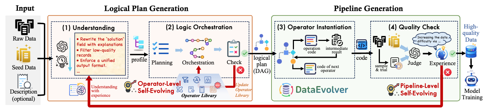
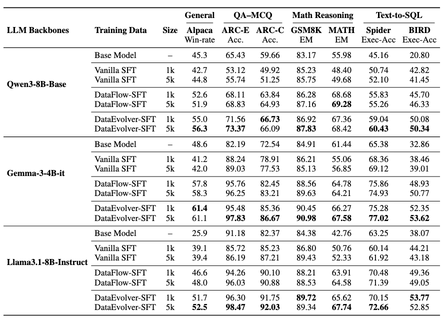
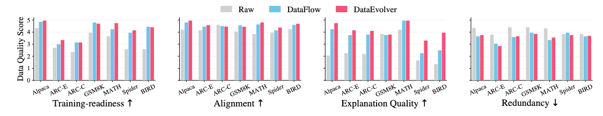
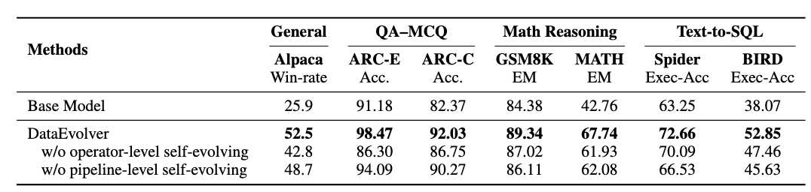
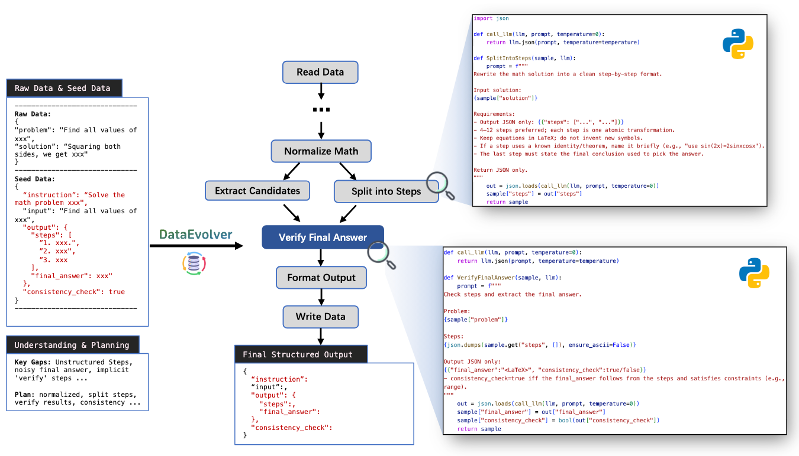
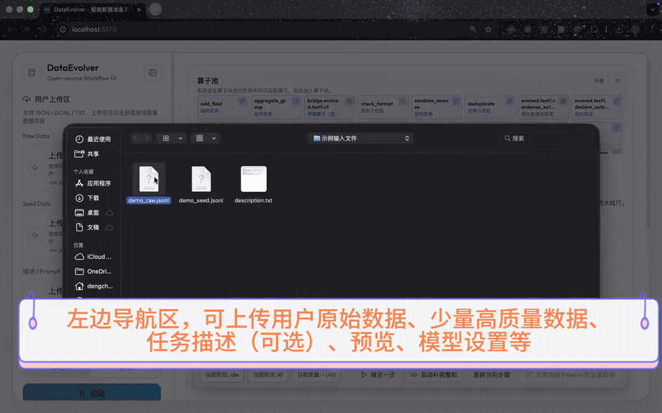
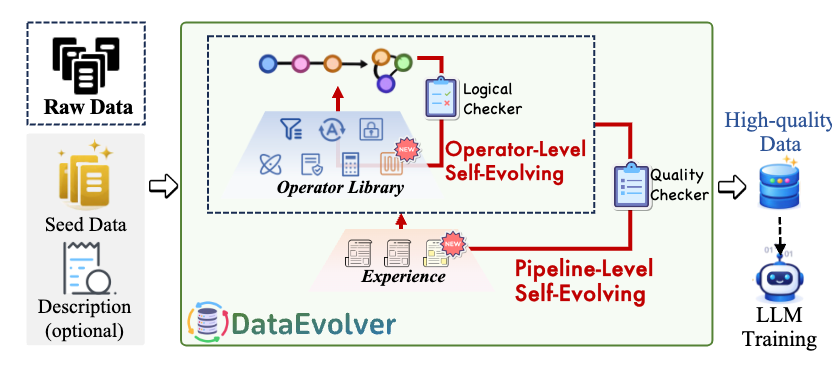

<div align="center">

# DataEvolver

**Automatic data preparation for LLMs via multi-level self-evolving pipelines**

[](https://www.python.org/)
[](https://pypi.org/project/dataevolver/)
[](https://fastapi.tiangolo.com/)
[](https://react.dev/)
[](assets/DataEvolver.pdf)
[](LICENSE)

**[Paper](assets/DataEvolver.pdf)** · **[Demo](#demo)** · **[Install](#install)** · **[Quick Start](#quick-start)** · **[Results](#results)** · **[Usage](#usage)**

<br/>



<br/>

<sub>Give us a ⭐ if DataEvolver helps your data-prep workflow.</sub>

</div>

## What is DataEvolver?

**Raw corpora are noisy. Seeds show what “good” looks like. DataEvolver closes the gap automatically.**

Turn noisy raw data + a handful of seed examples into **training-ready, seed-aligned datasets** — with executable DAGs, trial feedback, and iterative refinement built in.

You provide **raw data**, **seed examples**, and optionally a **task description**. DataEvolver:

1. **Understands** the target profile implied by seeds  
2. **Orchestrates** an operator DAG, validates it, and evolves missing operators when needed  
3. **Instantiates & trials** the pipeline, judges sample quality, and **refines across rounds**  
4. **Runs full preparation** when quality gates pass  

Unlike one-shot pipeline synthesis, DataEvolver jointly optimizes **executability** and **seed alignment** through **multi-level self-evolving** loops.

| You provide | DataEvolver does | You get |
|:--|:--|:--|
| Raw data | Understands target profile from seeds | Structured understanding artifact |
| Seed examples | Orchestrates & validates operator DAGs | Executable pipeline plan |
| Optional task description | Instantiates, trials, judges, evolves | High-quality prepared data |

> **One sentence:** a self-evolving data-prep system that optimizes both **can it run?** and **does it match seeds?** — not just one-shot pipeline synthesis.

### Why it matters

Training data quality remains a bottleneck in LLM post-training. Most approaches fall into two camps:

| Approach | Strength | Limitation |
|:--|:--|:--|
| **Predefined recipes** | Stable engineering | Hard to adapt to new tasks |
| **One-shot pipeline synthesis** | Flexible | Often fragile in execution & quality |

DataEvolver asks a harder, more practical question:

> **Can we automatically build a high-quality data preparation pipeline from raw data and only a small set of seed examples?**

### Highlights

- **Seed-guided understanding** — infer schema, style, and quality constraints from seeds + sampled raw data  
- **Operator-level self-evolving** — build, validate, and repair DAGs; synthesize operators when the registry is insufficient  
- **Pipeline-level self-evolving** — trial runs, pilot judging, experience summarization, and next-round refinement  
- **Three aligned interfaces** — Web UI, CLI, and HTTP API share the same workflow semantics  
- **Observable by design** — stage artifacts, orchestration retries, token ledger, and round history are all inspectable  
- **Open & extensible** — modular subsystems, editable operator registry, and scriptable automation  

## Results

> Empirical evidence from our paper — DataEvolver improves downstream training across diverse task types.

<table align="center">
<tr>
<td align="center"><b>~12%</b><br/><sub>avg relative gain vs.<br/>weaker prep settings</sub></td>
<td align="center"><b>7</b> benchmarks<br/><sub>instruction · MC-QA · math · SQL</sub></td>
<td align="center"><b>~40%</b><br/><sub>lower amortized token cost<br/>on average</sub></td>
</tr>
</table>

<br/>

<p align="center">
  
</p>

<p align="center"><i>Downstream performance across 7 benchmarks from 4 task categories (instruction following, MC-QA, math reasoning, text-to-SQL).</i></p>

<p align="center">
  
</p>

<p align="center"><i>DataEvolver vs. vanilla SFT on raw data and strong data-prep baselines — fewer, better-prepared samples can match or exceed larger weakly-prepared alternatives.</i></p>

<details>
<summary><b>Ablation & case study (click to expand)</b></summary>

<br/>

**Both evolution loops matter**

<p align="center"></p>

- Without **operator-level** evolution → pipelines are less executable and coherent  
- Without **pipeline-level** evolution → outputs are less seed-aligned  

**Case study: how a plan evolves across rounds**

<p align="center"></p>

See how an initial logical plan evolves into a refined executable pipeline, and how trial feedback becomes constraints for later rounds.

</details>

## Demo

Watch the **evolution canvas** in action — DAG orchestration tabs, instantiation cards, sample evaluation, and experience reflow across rounds.

<p align="center">
  
</p>

<p align="center">
  ▶ <b><a href="https://github.com/Akanezora0/DataEvolver/raw/main/assets/demo.mp4">Watch full demo</a></b>
  (2m50s)
  ·
  <a href="https://github.com/Akanezora0/DataEvolver/releases/download/demo-2026-04-18/DataEvolver_Demo_small.mov">Download HD .mov</a>
</p>

## How it works

<p align="center">
  
</p>


**Core workflow loop**

```text
understanding → orchestration → operator_evolution → instantiation
             → trial_run → quality_check → experience → (refine or full run)
```

When quality criteria are met, DataEvolver runs the refined pipeline on the full dataset.

| Layer | What happens |
|:------|:-------------|
| **Understanding** | Learn the target data profile from seeds and raw samples |
| **Operator evolution** | Fix DAG structure, dependencies, and missing capabilities |
| **Pipeline evolution** | Convert trial-vs-seed gaps into reusable experience for the next round |

Web UI, CLI, and HTTP API expose the **same workflow** — pick the interface that fits your workflow.

## Install

> Full cross-platform guide: **[docs/INSTALL.md](docs/INSTALL.md)**

### Prerequisites

| Component | Version |
|:--|:--|
| Python | **3.10+** |
| Node.js | **18+** LTS (Web UI only) |
| LLM API | OpenAI-compatible endpoint + key |

### From source (Web UI + CLI + API)

```bash
git clone https://github.com/Akanezora0/DataEvolver.git
cd DataEvolver
```

| Platform | One-command setup |
|:--|:--|
| Linux / macOS / Git Bash | `bash setup_env.sh` |
| Windows PowerShell | `powershell -ExecutionPolicy Bypass -File .\setup_env.ps1` |
| Windows CMD | `setup_env.bat` |
| **Any OS** | `python scripts/setup_env.py` |

This creates `.venv`, installs Python + npm dependencies, and copies `config/*.example.json` → `config/*.json` when missing.

Optional flags: `--skip-frontend` (API/CLI only) · `--frontend-only` (npm only).

### From PyPI (CLI + API)

```bash
pip install dataevolver
mkdir my_project && cd my_project
dataevolver init          # creates config/ + data/ from bundled templates
# edit config/api_config.json & config/api_keys.json
dataevolver --help
dataevolver-server --reload   # API on :8000 (Web UI still needs git clone + npm)
```

See **[docs/PUBLISHING.md](docs/PUBLISHING.md)** for maintainers (Test PyPI / PyPI upload).

### Configure LLM

```text
config/api_config.json   # provider, base URL, model
config/api_keys.json     # API key (gitignored — do not commit)
```

## Quick Start

### Start services (two terminals)

| Service | Cross-platform | Classic |
|:--|:--|:--|
| **Backend** `:8000` | `python scripts/dev.py backend` | `python run_server.py --reload` *(after activating `.venv`)* |
| **Frontend** `:5173` | `python scripts/dev.py frontend` | `cd frontend && npm run dev` |

Activate virtualenv if needed:

```bash
# Linux / macOS
source .venv/bin/activate

# Windows PowerShell
.\.venv\Scripts\Activate.ps1

# Windows Git Bash
source .venv/Scripts/activate
```

### Open the app

| Service | URL |
|:--|:--|
| Web UI | http://127.0.0.1:5173 |
| HTTP API | http://127.0.0.1:8000 |
| OpenAPI docs | http://127.0.0.1:8000/docs |

### First pipeline (CLI)

```bash
dataevolver session-start my_pipeline \
  --raw tmp/samples/finance_raw.jsonl \
  --seed tmp/samples/finance_seed.jsonl \
  --description tmp/samples/finance_description.txt

dataevolver workflow advance-all my_pipeline --max-steps 32
dataevolver workflow state my_pipeline
```

Open the Web UI to explore the evolution canvas, or stay in the terminal with `dataevolver advance my_pipeline`.

## Usage

DataEvolver exposes the **same workflow** through three interfaces.

<table>
<tr><th>Interface</th><th>Best for</th><th>Entry</th></tr>
<tr>
  <td><b>Web UI</b></td>
  <td>Exploration, visual DAG & trial inspection</td>
  <td><code>http://127.0.0.1:5173</code></td>
</tr>
<tr>
  <td><b>CLI</b></td>
  <td>Reproducible runs, scripting, CI</td>
  <td><code>dataevolver --help</code> · <code>dataevolver wf --help</code></td>
</tr>
<tr>
  <td><b>HTTP API</b></td>
  <td>Integration & automation</td>
  <td><code>http://127.0.0.1:8000/docs</code></td>
</tr>
</table>

### Web UI (recommended for exploration)

1. Create or select a pipeline session  
2. Upload raw data, seed data, and optional task description  
3. Advance step-by-step or run continuously  
4. Inspect DAG tabs, instantiation code, trial scores, and experience  
5. Trigger **full run** only after quality gates pass  

### CLI (recommended for reproducibility)

```bash
dataevolver --help
dataevolver state my_pipeline
dataevolver advance my_pipeline
dataevolver workflow advance-all my_pipeline --max-steps 32
dataevolver lang en    # switch CLI output language (zh / en)
```

**Stage commands**

| Stage | Command |
|:--|:--|
| Understanding | `dataevolver understand my_pipeline` |
| Orchestration | `dataevolver orchestrate my_pipeline` |
| Operator evolution | `dataevolver evolve-operators my_pipeline` |
| Instantiation | `dataevolver instantiate my_pipeline` |
| Trial run | `dataevolver trial my_pipeline` |
| Quality check | `dataevolver quality-check my_pipeline` |
| Experience | `dataevolver experience my_pipeline` |
| Full run | `dataevolver run my_pipeline` |
| Refresh DAG assessment | `dataevolver workflow validate-dag my_pipeline` |

**Debugging & automation**

```bash
dataevolver rerun my_pipeline orchestration
dataevolver tokens my_pipeline
dataevolver state --json my_pipeline
dataevolver advance --json my_pipeline
dataevolver next my_pipeline          # print next command only (script-friendly)
```

### Operator pool (manual add)

Add custom operators to the **task memory** layer (`data/operator_registry_user/<pipeline_id>.json`). Same assimilation path as auto-evolution — eligible for domain/general promotion later.

```bash
# List pool for a pipeline
dataevolver operators list -p my_pipeline
dataevolver op list -p my_pipeline --source task   # short alias: op

# Add one operator
dataevolver op add my_task.clean_answer -p my_pipeline \
  -d "Strip boilerplate and keep direct answers" \
  -c semantic --requires-llm

# Interactive wizard
dataevolver op add -p my_pipeline -i

# Import from JSON (see examples/operator_template.json)
dataevolver op add -p my_pipeline --from-file examples/operator_template.json

# Clone spec from an existing operator
dataevolver op add my_task.custom_filter -p my_pipeline --copy-from remove_field -d "My variant"

# Remove from task memory (cannot delete base operators)
dataevolver op remove my_task.clean_answer -p my_pipeline
```

After adding operators, **re-run orchestration** so the DAG can pick them up:

```bash
dataevolver workflow orchestrate my_pipeline
```

### HTTP API (recommended for integration)

| Endpoint | Purpose |
|:--|:--|
| `POST /api/sessions/start` | Create session & register manifest |
| `GET /api/workflow/{pipeline_id}/state` | Read workflow state |
| `POST /api/workflow/{pipeline_id}/advance` | Advance one step |
| `POST /api/workflow/{pipeline_id}/rerun` | Rerun from a stage |
| `POST /api/pipeline/{pipeline_id}/run-full` | Full dataset execution |
| `GET /api/operators/?pipeline_id=` | List merged operator pool |
| `POST /api/operators/add` | Manually add operator(s) |
| `POST /api/operators/remove` | Remove from task/domain/general memory |

Interactive schema: http://127.0.0.1:8000/docs

## Project structure

```text
DataEvolver/
├── core/           # config, paths, LLM client, logging, token ledger
├── subsystems/     # understanding, orchestration, instantiation, trial, workflow, …
├── web/            # FastAPI app & routers
├── frontend/       # React + Vite evolution canvas UI
├── cli/            # Typer CLI (`dataevolver`)
├── config/         # runtime configs & templates
├── data/           # artifacts, workflow state, uploads (runtime)
├── assets/         # paper figures, demo media
├── examples/       # sample configs (e.g. operator_template.json)
├── scripts/
│   ├── setup_env.py   # cross-platform installer (core)
│   └── dev.py         # dev server helpers
├── setup_env.sh       # Linux / macOS / Git Bash → setup_env.py
├── setup_env.ps1      # Windows PowerShell → setup_env.py
├── setup_env.bat      # Windows CMD → setup_env.py
└── docs/INSTALL.md    # full deployment guide
```

## Configuration

| File | Purpose |
|:--|:--|
| `config/api_config.json` | LLM provider, model, endpoints |
| `config/api_keys.json` | API credentials (keep out of git) |
| `config/operator_registry*.json` | Built-in & custom operators |
| `data/workflow_runs/{id}/state.json` | Per-pipeline workflow progress |

**Tips**

- Use `--force` / `rerun` when you want to regenerate a stage instead of reusing cached artifacts  
- Delete `data/generated_pipelines/{id}.json` to force re-instantiation  
- Token usage is tracked per workflow step via `dataevolver tokens`  
- CLI language: `dataevolver lang en` or `DATAEVOLVER_LANG=en`

## FAQ

<details>
<summary><b>Why does instantiation finish instantly?</b></summary>

If artifacts already exist, instantiation may **reuse** previous outputs (`skipped`). Built-in operators also use template delegation — only `requires_llm` operators trigger LLM codegen. Check the UI banner or `dataevolver state` message for reuse vs. LLM details.
</details>

<details>
<summary><b>Why does experience also finish quickly?</b></summary>

Experience summarization is **rule-based aggregation** over quality check, trial, and pilot results — it is designed for deterministic reflow, not LLM step-by-step rewriting.
</details>

<details>
<summary><b>Why do I see multiple orchestration tabs?</b></summary>

Each tab is a distinct orchestration attempt — typically a failed validation followed by a repaired DAG. Archives live under `data/artifact_history/{pipeline_id}/`.
</details>

<details>
<summary><b>Which data formats are supported today?</b></summary>

The current release focuses on **text** data preparation for LLM training: instruction tuning, QA-style supervision, math reasoning traces, and text-to-SQL. The architecture is extensible to broader modalities in future releases.
</details>

## Community

We welcome issues, ideas, and contributions!

| Channel | Link |
|:--|:--|
| **Bug reports & feature requests** | [GitHub Issues](https://github.com/Akanezora0/DataEvolver/issues) |
| **Questions & show-and-tell** | [GitHub Discussions](https://github.com/Akanezora0/DataEvolver/discussions) |
| **Demo video (full resolution)** | [Release download](https://github.com/Akanezora0/DataEvolver/releases/download/demo-2026-04-18/DataEvolver_Demo_small.mov) |

### Contributing (lightweight)

1. Fork the repo and create a feature branch  
2. Keep changes focused; match existing module boundaries (`subsystems/`, `web/`, `frontend/`, `cli/`)  
3. Run backend smoke tests / `npm run build` in `frontend/` when touching UI  
4. Open a PR with: **what changed**, **why**, and **how to verify**

**Good first contribution areas**

- New operators in the registry  
- Additional evaluation metrics or dataset adapters  
- UI polish on the evolution canvas  
- Docs, examples, and reproducible benchmark scripts  

## Citation

If you use DataEvolver in research, please cite our paper:

```bibtex

```

📄 Full paper: [assets/DataEvolver.pdf](assets/DataEvolver.pdf)

<p align="center">
  <sub>Built for teams who want <b>executable</b> and <b>seed-aligned</b> data pipelines — not one-shot prompts.</sub>
</p>
